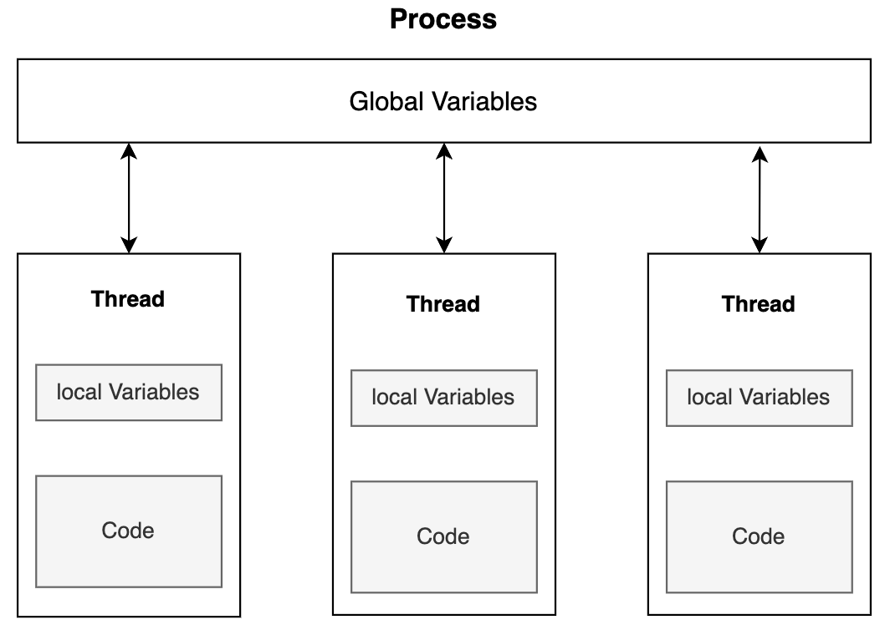
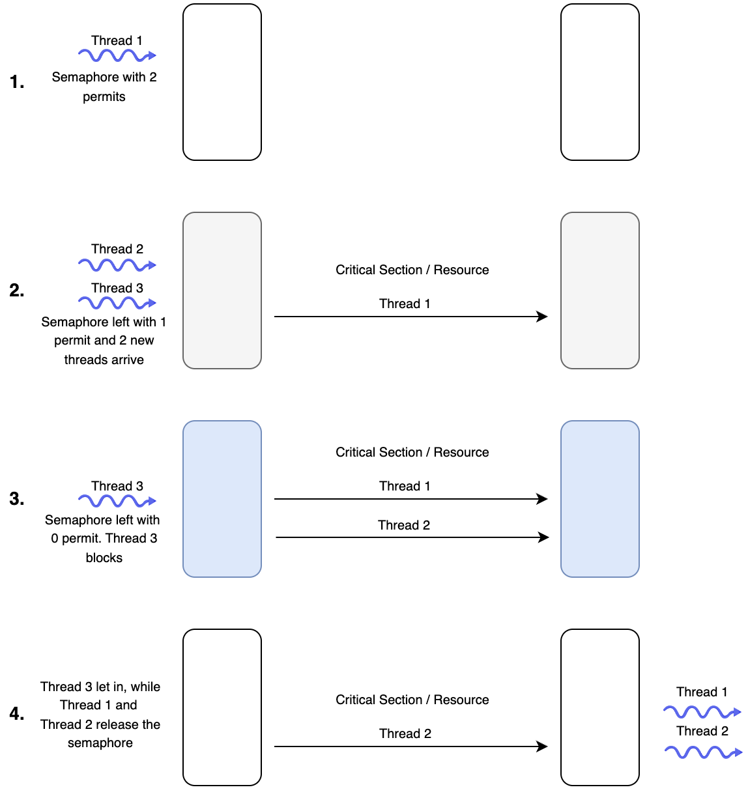

# web dev notes


### Java

#### foreach-loops


```java
class ForEachExample {
  public static void main(String[] args) {
    int[] primes = {2, 3, 5, 7, 11, 13};
    for(int p: primes) {
      System.out.println(p);
    }
  }
}
```

output:

```java
2
3
5
7
11
13
```


#### protected

1. 同一个包中：
    
    - protected成员（字段、方法等）可以被同一包内的所有类访问。
    
2. 不同包中：
    
    - protected成员可以被子类访问，即使这个子类在不同的包中。
    - 但是，子类只能通过继承的方式访问父类的protected成员，不能直接访问其他类的实例的protected成员。

#### field

类的成员变量被称作字段（fields）

static field

1. 静态字段（Static fields）：
    
    - 所有实例共享同一个字段。
    - 当一个实例修改静态字段时，这个修改会影响到所有其他实例。
    - 静态字段属于类本身，而不是单个实例。
    
2. 非静态字段（Non-static fields）：
    
    - 每个实例都有自己的字段副本。
    - 当一个实例修改其非静态字段时，只会影响该实例自己的字段值。
    - 其他实例的相同字段不会受到影响。

final field

一旦被赋值，final字段的值就不能再被改变。


```java
class Car {
  // Final variable capacity
  final int capacity = 4;
}

class Demo {
   public static void main(String args[]) {
      Car car = new Car();
      car.capacity = 5; // Trying to change the capacity value
   }
}
```

output: 
```java
main.java:9: error: cannot assign a value to final variable capacity car.capacity = 5; // Trying to change the capacity value ^ 1 error
```

#### func overloading

overloading：同名不同参。

多态（Polymorphism）是面向对象编程中一个非常重要的概念，而方法重载（overloading）在实现多态中扮演着至关重要的角色。

构造器就是典型例子。

构造器分类：Default constructor, parameterized constructor

> 如果你没有定义任何构造函数，Java编译器会为你插入一个默认构造函数。因此，一旦类被编译，它至少会有一个无参数的构造函数。

#### this

在Java中，有几种情况下必须使用`this`关键字。

1. 区分局部变量和实例变量

当方法或构造函数的参数名与实例变量名相同时，必须使用`this`来明确指向实例变量。

```java
public class Person {
    private String name;

    public Person(String name) {
        this.name = name; // 必须使用this
    }
}
```

2. 在构造函数中调用另一个构造函数

当一个类有多个构造函数，并且想在一个构造函数中调用另一个构造函数时，必须使用`this()`。

```java
public class Rectangle {
    private int width, height;

    public Rectangle() {
        this(1, 1); // 调用另一个构造函数
    }

    public Rectangle(int width, int height) {
        this.width = width;
        this.height = height;
    }
}
```

3. 将当前对象作为参数传递

当需要将当前对象作为参数传递给另一个方法时，必须使用`this`。

```java
public class Node {
    private Node next;

    public void setNext(Node node) {
        node.next = this; // 将当前对象作为参数传递
    }
}
```

4. 返回当前对象以实现方法链

当想要实现方法链（method chaining）时，必须返回`this`。

```java
public class StringBuilder {
    private String str = "";

    public StringBuilder append(String s) {
        str += s;
        return this; // 返回当前对象以支持方法链
    }
}

// 使用: new StringBuilder().append("Hello").append(" ").append("World");
```

#### `super` in inheritance

超类(SuperClass)（父类(Parent Class)或基类(Base Class)）：这个类允许在另一个类中重用其非私有成员。  
子类(SubClass)（派生类(Child Class or Derived Class)）：这个类是从超类继承而来的。

子类的对象可以使用：
子类中定义的所有非私有成员，父类中定义的所有非私有成员。

> 有些类是不能继承的，比如final定义的类和内置的Integer类；
> 一个类一次只能继承自一个其他类，并且一个类不能继承自己。

1. 访问父类的字段

当子类和父类有同名字段时，使用super访问父类字段。
```java
class Parent {
    int x = 10;
}
class Child extends Parent {
    int x = 20;
    void printX() {
        System.out.println("子类的x: " + x);
        System.out.println("父类的x: " + super.x);
    }
}
```

2. 调用父类的方法

当子类重写了父类的方法，但仍需调用父类的该方法时。
```java
class Animal {
    void makeSound() {
        System.out.println("动物发出声音");
    }
}
class Dog extends Animal {
    void makeSound() {
        super.makeSound();  // 调用父类的方法
        System.out.println("狗吠叫");
    }
}
```

3. 调用父类的构造函数

在子类构造函数中调用父类的构造函数。
```java
class Vehicle {
    Vehicle(String type) {
        System.out.println("创建了一个" + type);
    }
}
class Car extends Vehicle {
    Car() {
        super("汽车");  // 调用父类的构造函数
    }
}
```

#### Inheritance type

##### Single Inheritance


```java
class Vehicle {          //Base Vehicle class  

  private int topSpeed;
  public void setTopSpeed(int speed) {
    this.topSpeed=speed;
    System.out.println("The top speed is set to: "+ topSpeed);
  }

} 

class Car extends Vehicle { // sub class Car extending from Vehicle

  public void openTrunk() {  
    System.out.println("The Car trunk is Open Now"); 
  } 
  
} 

class Main {

  public static void main(String[] args) {  
    Car corolla = new Car(); 
    corolla.setTopSpeed(220);
    corolla.openTrunk();
  } 
```

output:

```java
The top speed is set to: 220 
The Car trunk is Open Now
```

##### Multi-level Inheritance


```java
class Vehicle {          //Base Vehicle class  

  private int topSpeed;

  public void setTopSpeed(int speed) {
    this.topSpeed=speed;
    System.out.println("The top speed is set to: "+ topSpeed);
  }
  
}

class Car extends Vehicle { // Derived from Vehicle Base for Prius

  public void openTrunk() {
    System.out.println("The Car trunk is Open Now!"); 
  } 

} 

class Prius extends Car {// Derived from Prius & can be base to any further class

  public void turnOnHybrid() {
    System.out.println("The Hybrid mode is turned on!"); 
  } 

} 

class Main {

  public static void main(String[] args) {
    Prius priusPrime = new Prius(); 
    priusPrime.setTopSpeed(220);
    priusPrime.openTrunk();
    priusPrime.turnOnHybrid();
  }

}
```

output:

```java
The top speed is set to: 220 
The Car trunk is Open Now! 
The Hybrid mode is turned on!
```

##### Hierarchical Inheritance


```java
class Vehicle {          //Base Vehicle class  

  private int topSpeed;

  public void setTopSpeed(int speed) {
    this.topSpeed=speed;
    System.out.println("The top speed of "+getClass().getSimpleName()+" is set to: "+ topSpeed);
  }

} 

class Car extends Vehicle { // Derived from Vehicle Base for Prius

  //implementation of Car class
} 

class Truck extends Vehicle {// Derived from Prius can be base to any further class

  //implementation of Truck class
} 

class Main {

  public static void main(String[] args) {
    Car corolla = new Car(); 
    corolla.setTopSpeed(220);

    Truck volvo = new Truck();
    volvo.setTopSpeed(120);
  } 

}

```

output:
```java
The top speed of Car is set to: 220 
The top speed of Truck is set to: 120
```

##### Multiple Inheritance


> Only applicable using interfaces in java.

eg:
```java
class Car {  // Base class

  private int model;  // Common features of all cars
  private String manufacturer;

  public Car(int model, String manufacturer) {  // Constructor
    this.model = model;
    this.manufacturer = manufacturer;
  }

  public void printDetails() {

    System.out.println("The model of " + getClass().getSimpleName() + " is: " + model);
    System.out.println("The manufacturer of " + getClass().getSimpleName() + " is: " + manufacturer);
  }

}  // End of Car class

interface IsSedan {  // Interface for sedans

  int bootSpace = 420;  // Sedans have boot space

  void bootSpace();    // Every sedan must implement this

}  // End of IsSedan interface

class Elantra extends Car implements IsSedan {  // Elantra is a Car and is a Sedan also

  private String variant;    // Elantra's data member

  public Elantra(int model, String variant) {  // Constructor
    super(model, "Hyundai");  // Calling the parent constructor with alredy known manufacturer
    this.variant = variant;  
  }

  @Override
  public void bootSpace() { // Implementation of the interface method
    System.out.println("The bootspace of Elantra is: " + IsSedan.bootSpace +" litres");
  }

  @Override
  public void printDetails() {  // Overriding the parent class's inherited method
    super.printDetails();    // Calling the method from parent class
    System.out.println("The variant of Elantra is: " + variant); // printing the data member of this class
  }
  
}  // End of Elantra class


class Main {

  public static void main(String[] args) {

    Elantra sport = new Elantra(2019, "Sport");  //creating Sports variant Elantra
    Elantra eco = new Elantra(2018, "Eco");      //creating Eco variant Elantra

    sport.printDetails();    
    sport.bootSpace();       

    System.out.println();

    eco.printDetails();
    eco.bootSpace();
  }
  
}
```

##### Hybrid Inheritance


> Only applicable using interfaces in java.

#### overloading vs overriding

当然，我很乐意用例子来解释方法重载和方法重写的区别。让我们通过一些具体的代码示例来说明。

1. 方法重载（Method Overloading）：

方法重载是在同一个类中定义多个同名但参数不同的方法。

```java
public class Calculator {
    // 两个整数相加
    public int add(int a, int b) {
        return a + b;
    }
    
    // 三个整数相加
    public int add(int a, int b, int c) {
        return a + b + c;
    }
    
    // 两个浮点数相加
    public double add(double a, double b) {
        return a + b;
    }
}
```

在这个例子中，`add` 方法被重载了三次。编译器会根据传入的参数类型和数量来决定调用哪个方法。

使用示例：
```java
Calculator calc = new Calculator();
System.out.println(calc.add(5, 3));        // 调用第一个方法
System.out.println(calc.add(5, 3, 2));     // 调用第二个方法
System.out.println(calc.add(5.5, 3.2));    // 调用第三个方法
```

2. 方法重写（Method Overriding）：

方法重写是在子类中重新定义父类中已有的方法。

```java
public class Animal {
    public void makeSound() {
        System.out.println("动物发出声音");
    }
}

public class Dog extends Animal {
    @Override
    public void makeSound() {
        System.out.println("狗在汪汪叫");
    }
}

public class Cat extends Animal {
    @Override
    public void makeSound() {
        System.out.println("猫在喵喵叫");
    }
}
```

在这个例子中，`Dog` 和 `Cat` 类都重写了 `Animal` 类的 `makeSound` 方法。

使用示例：
```java
Animal animal1 = new Dog();
Animal animal2 = new Cat();

animal1.makeSound();  // 输出：狗在汪汪叫
animal2.makeSound();  // 输出：猫在喵喵叫
```

主要区别：

1. 重载发生在同一个类中，而重写发生在父子类之间。
2. 重载的方法名相同但参数不同，重写的方法名和参数都相同。
3. 重载是编译时多态（静态绑定），重写是运行时多态（动态绑定）。
4. 重载主要用于增加方法的灵活性，而重写用于实现多态性。

#### Polymorphism

静态多态性（Static polymorphism）也被称为编译时多态性。

动态多态性（Dynamic polymorphism）也被称为运行时多态性。

静态多态性：

1. 在编译时解析。
2. 被称为静态多态性。
3. 静态多态性使用方法重载。

动态多态性：

1. 在运行时解析。
2. 被称为动态多态性。
3. 动态多态性使用方法重写。

#### abstract & interface

| **Interfaces**              | **Abstract Classes**                    |
| --------------------------- | --------------------------------------- |
| 支持多重继承                      | 不支持多重继承                                 |
| 所有成员都是 `public`的            | 可以有`private`, `protected` 和 `public`的成员 |
| 所有数据成员都是`static` 和 `final`的 | 不能有非静态和非最终的成员                           |
| 不能有构造器                      | 可以定义构造函数                                |

抽象方法没有方法体或定义，它只能在抽象类或接口中声明。

非抽象类不能包含抽象方法，所以如果一个类的实现中包含任何抽象方法，那么这个类必须被声明为抽象类。

接口中的方法默认是public abstract的。

```java
// 抽象类中的抽象方法
abstract class Animal {
    // 抽象方法声明，注意没有方法体
    public abstract void makeSound();
    
    // 普通方法
    public void sleep() {
        System.out.println("Zzz...");
    }
}

// 接口中的抽象方法
interface Flyable {
    // 接口中的方法默认是public abstract的，可以省略这些修饰符
    void fly();
}

// 具体类实现抽象类和接口
class Bird extends Animal implements Flyable {
    // 实现抽象类中的抽象方法
    @Override  
    public void makeSound() {
        System.out.println("Tweet tweet!");
    }
    
    // 实现接口中的抽象方法
    @Override // 如果你不实现flying()方法，你会得到一个错误！
    public void fly() {
        System.out.println("The bird is flying.");
    }
}

public class AbstractMethodExample {
    public static void main(String[] args) {
        Bird bird = new Bird();
        bird.makeSound();  // 输出：Tweet tweet!
        bird.sleep();      // 输出：Zzz...
        bird.fly();        // 输出：The bird is flying.
    }
}
```

类使用关键字implements来实现接口，而接口使用关键字extends来继承另一个接口

接口中声明或实现的所有方法默认都是`public`的，所有变量默认都是`public static final`的。

和抽象类一样，接口不能被实例化。

借口中不能有构造函数。

一个类不能继承多个class，但能够implements多个接口。


接口不能声明为`public`或者`private`的。

接口中的static方法不能被重写。

##### functional interfaces

只有一个抽象方法的接口称为函数式接口。

使用@FunctionalInterface注解的一定是functional interface，而functional interface不一定使用@FunctionalInterface注解。


```java
// 使用注解，一定是函数式接口  
@FunctionalInterface  
interface Example1 {  
    void singleMethod();  
}  

// 没有注解，但实际上是函数式接口  
interface Example2 {  
    void singleMethod();  
}  

// 没有注解，不是函数式接口  
interface Example3 {  
    void method1();  
    void method2();  
}
```

#### Class relations

好的,我来为您解释这三种关系,并分别举例说明:

1. IS A (是一个)关系:

这是继承关系,表示一个类是另一个类的特殊类型。

例子:狗是动物
- 动物是一个基类
- 狗是动物的一个子类
- 狗继承了动物的所有基本特征,同时可能有自己特有的属性和方法

代码示例:
```python
class 动物:
    def 呼吸(self):
        print("我能呼吸")

class 狗(动物):
    def 吠叫(self):
        print("汪汪!")

小狗 = 狗()
小狗.呼吸()  # 继承自动物类
小狗.吠叫()  # 狗类特有的方法
```

2. PART-OF (部分-整体)关系:

这表示一个类是另一个类的组成部分,且生命周期完全依赖于整体。

例子:引擎是汽车的一部分
- 汽车是整体
- 引擎是汽车的一个组成部分
- 引擎的生命周期与汽车完全绑定,汽车被销毁时,引擎也就不存在了

代码示例:
```python
class 引擎:
    def 启动(self):
        print("引擎启动")

class 汽车:
    def __init__(self):
        self.引擎 = 引擎()
    
    def 行驶(self):
        self.引擎.启动()
        print("汽车开始行驶")

我的车 = 汽车()
我的车.行驶()
```

3. HAS-A (有一个)关系:

这是聚合关系,表示一个类拥有另一个类的对象,但它们的生命周期可以独立。

例子:人有一部手机
- 人是拥有者
- 手机是被拥有的对象
- 即使人不在了,手机还可以继续存在或被其他人使用

代码示例:
```python
class 手机:
    def 打电话(self):
        print("正在通话中")

class 人:
    def __init__(self, 手机=None):
        self.手机 = 手机
    
    def 使用手机(self):
        if self.手机:
            self.手机.打电话()
        else:
            print("没有手机可用")

小米手机 = 手机()
张三 = 人(小米手机)
张三.使用手机()

# 即使张三不在了,手机还可以被李四使用
李四 = 人(小米手机)
李四.使用手机()
```

##### Aggregation

aggregation遵循has-A模型，其中一个类拥有另一个类的对象，二者的生命周期是独立的。


```java
class Country {
  
    private String name;
    private int population;

    public Country(String n, int p) {
      name = n;
      population = p;
    }
    public String getName() {
      return name;
    }
  
}

class Person {
  
    private String name;
    private Country country; // An instance of Country class

    public Person(String n, Country c) {
      name = n;
      country = c;
    }

    public void printDetails() {
      System.out.println("Name: " + name);
      System.out.println("Country: " + country.getName());
    }
  
}

class Main {
  
  public static void main(String args[]) {
    Country country = new Country("Utopia", 1);
    {
      Person user = new Person("Darth Vader", country);
      user.printDetails();
    }
    // The user object's lifetime is over

    System.out.println(country.getName()); // The country object still exists!
  }
  
}
```

##### Composition

composition遵循part-of模型，其中一个类是另一个类的一部分，被拥有对象的生命周期依赖于拥有者的生命周期。

```java
class Engine {
  
  private int capacity;
  
  public Engine(){
    capacity = 0;
  }
  
  public Engine(int cap) {
    capacity = cap;
  }
  
  public void engineDetails() {
    System.out.println("Engine details: " + capacity);
  }
  
}

class Tires {
  
  private int noOfTires;
  
  public Tires() {
    noOfTires = 0;
  }
  
  public Tires(int nt) {
    noOfTires = nt;
  }
  
  public void tireDetails() {
    System.out.println("Number of tyres: " +  noOfTires);
  }
  
}

class Doors {
  
  private int noOfDoors;
  
  public Doors() {
    noOfDoors = 0;
  }
  
  public Doors(int nod) {
    noOfDoors = nod;
  }
  
  public void doorDetails() {
    System.out.println("Number of Doors: " + noOfDoors);
  }
  
}

class Car {
  
  private Engine eObj;
  private Tires tObj;
  private Doors dObj;
  private String color;
  
  public Car(String col, int cap, int nt, int nod) {
    this.eObj = new Engine(cap);;
    this.tObj = new Tires(nt);;
    this.dObj = new Doors(nod);
    
    color = col;    
  }
  
  public void carDetail() {
    eObj.engineDetails();
    tObj.tireDetails();
    dObj.doorDetails();
    System.out.println("Car color: " + color);
  }
  
}
  
class Main {
  
  public static void main(String[] args) {
    Car cObj = new Car("Black", 1600, 4, 4);
    cObj.carDetail();
  }
}
```

### Recursion


-  Literative

class MainClass {


```java
private static int factorialIterative(int n) {

  int factorialResult = 1;

  for (int i = 1; i <= n; i++) {
	factorialResult = factorialResult * i;
	}
  return factorialResult;
  
}

public static void main( String args ) {
	int result = factorialIterative(5);
	System.out.println("The factorial is: " + result);
	}
}
```

- Recursive


```java
class MainClass {

private static int factorialRecursive(int n) {

  if (n == 1) {
	return 1;
	}
  else {
	return (n * factorialRecursive(n-1));
}
  
}

public static void main( String args[] ) {
	int result = factorialRecursive(5);
	System.out.println("The factorial is: " + result);
	}
}
```


eg. recursion in linked list


```java
class Solution {   
    /* Returns count of nodes in linked list */  
    public static int lengthOfList(Node head) {  
        if (head == null) {  
            return 0;  
        }  
        return 1 + lengthOfList(head.next);  
    }  
}
```


#### Indiract Recursion(Mutual Recursion)

eg:
```java
class ExampleClass {

    static int n = 0;
    public static void indirectRecursiveFunction1() {
        if (n <= 20) {
            System.out.print(n + " ");
            n++;
            indirectRecursiveFunction2();
        }
        else {
            return;
        }
    }

    public static void indirectRecursiveFunction2() {
        if (n <= 20) {
            System.out.print(n + " ");
            n++;
            indirectRecursiveFunction1();
        }
        else {
            return;
        }
    }

    public static void main( String args[] ) {
        indirectRecursiveFunction1();
    }
}
```

#### Recursion with Numbers

##### Fibonacci

- Find the $n$ th
```java
class FibonacciClass {

    private static int fibonacci(int n) {
        // Base case 
        if (n <= 1) {
            return n;
        }
        // Recursive case
        else {
            return (fibonacci(n-1) + fibonacci(n-2));
        }
    }

    public static void main( String args[] ) {
        int input = 5;
        System.out.println("Fibonacci sequence for the first " + input + " elements is:");

        // Loop to print all the fibonacci sequence elements
        int i = 0;
        while (i < input) {
            System.out.print(fibonacci(i) + " ");
            i++;
        }
    }
}
```

##### Greatest Common Devisor

**使用欧几里得算法**

欧几里得算法（也称辗转相除法）是计算最大公约数的高效算法。其核心思想是两个数的最大公约数等于较小的数和两数相除余数的最大公约数。

**代码如下：**

```java
public class Solution {
    public static int gcd(int num1, int num2) {
        if (num2 == 0) {
            return num1;
        } else {
            return gcd(num2, num1 % num2);
        }
    }
}
```

**欧几里得算法的原理：**

- **递归公式：** `gcd(a, b) = gcd(b, a % b)`
- **终止条件：** 当 `b == 0` 时，`gcd(a, 0) = a`

#### Recursion with Strings

##### String Reverse

```java
public static String reverseString(String myStr) {
        // Base case
        if (myStr.isEmpty()) {
            return myStr;
        }

        // Recursive case
        else {
		return reverseString(myStr.substring(1)) + myStr.charAt(0);
        }
    }
```

##### Remove Duplicate

```java
private static String remDuplicates(String text) {
        if (text.length() == 1) {
            return text;
        }
        
        if (text.substring(0,1).equals(text.substring(1,2))) {
            return remDuplicates(text.substring(1));
        }
        else {
            return text.substring(0,1) + remDuplicates(text.substring(1));
        }
    }
```

##### Find all Permutations


```java
class Solution {  

    public static void permutations(char[] array, int length) {  
        // 直接在这里调用排列生成函数，传入字符数组和起始下标0  
        permutationsHelper(array, 0);  
    }  

    // 辅助函数用于生成排列  
    private static void permutationsHelper(char[] array, int start) {  
        if (start == array.length - 1) {  
            // 当到达字符串的最后一个字符时，输出结果  
            System.out.println(new String(array));  
        } else {  
            for (int i = start; i < array.length; i++) {  
                swap(array, start, i); // 交换当前位置的字符  
                permutationsHelper(array, start + 1); // 递归调用，移动到下一个字符  
                swap(array, start, i); // 回溯，交换回来  
            }  
        }  
    }  

    // 辅助函数，用于交换数组中两个字符的位置  
    private static void swap(char[] array, int i, int j) {  
        char temp = array[i];  
        array[i] = array[j];  
        array[j] = temp;  
    }  

    public static void main(String args[]) {  
        char[] input = {'a', 'b'};  
        System.out.println("Permutations of a string");  
        permutations(input, input.length); // 这里传入input和length  
    }  
}
```

递归思路：在每个循环中，我们首先固定第一个字符到当前位置，然后递归调用函数，将剩余的字符进行排列；每当排列完一个字符后，将固定的字符位置还原，依次固定后面的字符到当前位置；这样每一个字符在每个位置都会出现一次，从而包括了所有的排列。

#### Recursion with Arrays

##### First Occurrence


```java
class ArrayClass {

  private static int firstOccurrence(int[] a, int n, int currentIndex) {
    if (a.length == currentIndex) {
      return -1;
    }
    else if (a[currentIndex] == n) {
        return currentIndex;
    }
    else {
        return firstOccurrence(a, n, currentIndex+1);
    }
  }
  
  public static void main(String[] args) {
    System.out.print("{");
    
    int[] array = {2,3,4,1,7,8,3};
    for (int i = 0; i < array.length; i++) {
      System.out.print(array[i] + " ");
    }
    System.out.println("}");
    
    int num = 3;

    int result = firstOccurrence(array, num, 0);
    System.out.println("The first occurrence of the number " + num + " is at index: " + result);
  }
}
```

##### Reverse Array

- Literation

```java
import java.io.*;

class sample {
  
  private static void invert(int[] arr) {
    int s = arr.length/2;
    int tmp = arr.length-1;
    int tmp2 = 0;
    for (int i=0; i<s; i++) {
      tmp2 = arr[i];
      arr[i] = arr[tmp];
      arr[tmp] = tmp2;
      tmp = tmp - 1;
    }
  }
  
  public static void main(String[] args) {
    System.out.println("Hello world");
    
    int[] a = {5,4,3,2,1,0};
    System.out.print("{ ");
    for (int i = 0; i < a.length; i++) {
      System.out.print(a[i] + ", ");
    }
    System.out.print("} ");
    
    System.out.println(" ");
    
    invert(a);
    
    System.out.print("{ ");
    for (int i = 0; i < a.length; i++) {
      System.out.print(a[i] + ", ");
    }
    System.out.print("} ");
    
  }
}
```

- Recursion


```java
import java.io.*;

class ExampleClass { 

  private static void invert(int[] array, int currentIndex) {
    if (currentIndex < array.length/2) {
      // swap array[currentIndex] and array[array.length-1-currentIndex]
      int temp = array[currentIndex];
      array[currentIndex] = array[array.length-1-currentIndex];
      array[array.length-1-currentIndex] = temp;
      
      invert(array, currentIndex+1);
    }
  }
  
  public static void main(String[] args) {
    System.out.println("Before: ");
    
    int[] array = {1,2,3,4,5,6,7};
    System.out.print("{ ");
    for (int i = 0; i < array.length; i++) {
      System.out.print(array[i] + " ");
    }
    System.out.println("} ");
    
    System.out.println("After: ");
    
    invert(array, 0);
    
    System.out.print("{ ");
    for (int i = 0; i < array.length; i++) {
      System.out.print(array[i] + " ");
    }
    System.out.print("} ");
  }
}
```

##### Sort Array

- Bubble Sort(Recursion)


```java
public class BubbleSort {  

    // Method to implement bubble sort using recursion  
    public static void bubbleSort(int[] arr, int n) {  
        // Base case: If the size of the array is 1 or less, it is already sorted  
        if (n == 1) {  
            return;  
        }  

        // One pass of bubble sort. After this pass, the largest element  
        // will be at the end of the array.  
        for (int i = 0; i < n - 1; i++) {  
            if (arr[i] > arr[i + 1]) {  
                // Swap arr[i] and arr[i + 1]  
                int temp = arr[i];  
                arr[i] = arr[i + 1];  
                arr[i + 1] = temp;  
            }  
        }  

        // Recursive call for the remaining unsorted elements  
        bubbleSort(arr, n - 1);  
    }  

    // Method to print the array  
    public static void printArray(int[] arr) {  
        for (int value : arr) {  
            System.out.print(value + " ");  
        }  
        System.out.println();  
    }  

    // Main method to test the bubble sort  
    public static void main(String[] args) {  
        int[] arr = {64, 34, 25, 12, 22, 11, 90};  
        System.out.println("Unsorted array:");  
        printArray(arr);  

        bubbleSort(arr, arr.length);  

        System.out.println("Sorted array:");  
        printArray(arr);  
    }  
}
```

#### Recursion with Data Structures

##### 反向打印链表


```java
class LinkedList {

    // Linked List Node
    static class Node {
      int value;
      Node next;
    };

    public static void reverse(Node head) {

      // Base case
      if (head == null) {
        return;
      }

      // Recursive case
      else {
        reverse(head.next);
        System.out.print(head.value + " ");
      }
    } 

    static Node insertAtHead(Node temp_head, int new_value) {
      Node new_Node = new Node();
      new_Node.value = new_value;
      new_Node.next = (temp_head);
      (temp_head) = new_Node;

      return temp_head;
    }

    public static void main( String args[] ) {
        // Empty Linked List
        Node head = null;

        // Linked List = 1->2->3->4->5
        head = insertAtHead(head, 5);        
        head = insertAtHead(head, 4);        
        head = insertAtHead(head, 3);        
        head = insertAtHead(head, 2);        
        head = insertAtHead(head, 1);

        // Print the original Linked List
        System.out.println("Linked List: ");
        for (Node i = head; i != null; i = i.next) {
          System.out.print(i.value + " ");
        }

        // Print the reversed Linked List
        System.out.println(" ");
        System.out.println("Reversed Linked List: ");
        reverse(head);
    }
}
```

##### 遍历链表查找定值


```java
class Solution {
    public static boolean search(Node head, int num) {
      if(head==null){
        return false;
      } else if(head.value==num){
        return true;
      } else {
        head=head.next;
        return search(head,num);
      }
      
    } 
}
```

##### 二叉树递归插值

[解释点击链接查看](https://www.educative.io/module/page/g5g3ywCmLqmMJ5YLr/10370001/4830990535491584/6299919900475392)
```java
class binarySearchTree {

	//Variables
	private Node root;
	//Getter for Root
	public Node getRoot() {
		return root;
	}
  //Setter for root
  public void setRoot(Node root) {
		this.root = root;
	}


	//Recursive function to insert a value in BST 
	public Node recursive_insert(Node currentNode, int value) {

		//Base Case
		if (currentNode == null) {
			return new Node(value);
		}

		if (value < currentNode.getData()) {
			//Iterate left sub-tree
			currentNode.setLeftChild(recursive_insert(currentNode.getLeftChild(), value));
		} else if (value > currentNode.getData()) {
			//Iterate right sub-tree
			currentNode.setRightChild(recursive_insert(currentNode.getRightChild(), value));
		} else {
			// value already exists
			return currentNode;
		}

		return currentNode;
	}

	//Function to call recursive insert
	public boolean insert(int value) {

		root = recursive_insert(this.root, value);
		return true;
	}

	//Function to check if Tree is empty or not  
	public boolean isEmpty() {
		return root == null; //if root is null then it means Tree is empty
	}

	//Just for Testing purpose 
	public void printTree(Node current) {

		if (current == null) return;

		System.out.print(current.getData() + ",");
		printTree(current.getLeftChild());
		printTree(current.getRightChild());

	}
	public static void main(String args[]) {

		binarySearchTree bsT = new binarySearchTree();
		bsT.insert(6);
		bsT.insert(4);
		bsT.insert(8);
		bsT.insert(5);
		bsT.insert(2);
		bsT.insert(8);
		bsT.insert(12);
		bsT.insert(10);
		bsT.insert(14);
		bsT.printTree(bsT.getRoot());

	}
}
```

##### 有向图深度优先遍历

深度优先搜索

[可视化递归过程](https://www.educative.io/module/page/g5g3ywCmLqmMJ5YLr/10370001/4830990535491584/5232151308533760)
```java
class ExampleClass {

    static class Graph {
        int numVertices;
        LinkedList<Integer>[] tempList;

        Graph(int numVertices) {
            this.numVertices = numVertices;
            tempList = new LinkedList[numVertices];
            for (int i = 0; i < numVertices ; i++) {
                tempList[i] = new LinkedList<>();
            }
        } 

        // Method to add an edge between 2 nodes in the Graph
        // fromNode 2 toNode 5 ==> 2 -> 5
        public void addEgde(int fromNode, int toNode) {
            tempList[fromNode].addFirst(toNode);
        }

        public void DFSRecursion(int startVertex) {
            boolean[] visitedArr = new boolean[numVertices];
            dfs(startVertex, visitedArr);
        }

        // DFS Recursion takes place here
        public void dfs(int start, boolean [] visitedArr) {
            visitedArr[start] = true;

            System.out.print(start + " ");

            for (int i = 0; i < tempList[start].size(); i++) {
                int toNode = tempList[start].get(i);
                if (!visitedArr[toNode])
                    dfs(toNode,visitedArr);
            }
        }
    }

    public static void main( String args[] ) {
        System.out.println( "Your DFS path is: " );

        int nVertices = 6;

        Graph g = new Graph(nVertices);
        
        g.addEgde(0, 1);
        g.addEgde(0, 2);
        g.addEgde(1, 3);
        g.addEgde(1, 4);
        g.addEgde(2, 5);

        // Root node given as argument to the function
        g.DFSRecursion(0);
    }
}
```
 
##### 拓扑排序

拓扑排序是一种对有向无环图进行排序的方法。

## Multithreading

### 多线程基础

#### 进程和线程

- 进程

进程是正在执行的程序。进程是一个执行环境，由指令、用户数据和系统数据段组成，还有许多其他资源，比如运行时获取的CPU、内存、地址空间、磁盘和网络I/O。一个程序可以同时有多个副本在运行，但一个进程必然只属于一个程序。

- 线程

线程是进程中最小的执行单元。线程按顺序执行指令。一个进程可以有多个线程同时运行。通常，进程会有一些状态在所有线程之间共享，同时每个线程也会有一些私有状态。进程中线程之间共享的全局状态对所有线程是可见和可访问的，当任何线程尝试读取或写入这个全局共享状态时，需要进行格外的操作。



#### 并发与并行

- Series Execution

执行完一个程序再执行下一个程序。

类比马戏团的小丑同时只抛一个球。

- Concurrence

在重叠的时间区间内运行多个独立程序或多个相同程序的独立单元。

类比马戏团的小丑同时抛多个球。

- Parallelism

能够同时执行多个程序。

类比马戏团的小丑同时抛多个球并且同时骑车。

**并发系统不是并行系统，但并行系统是并发系统。**

#### 抢占式 & 协作式

Cooperative Multitasking vs Preemptive Multitasking

抢占式多任务允许操作系统中断一个程序,转而执行另一个等待的任务,而协作式多任务则要求表现良好的程序自愿将控制权交给调度器。抢占式多任务提供更可预测和可靠的调度,因为操作系统决定何时切换任务,而协作式多任务则依赖于程序的相互配合才能实现调度。早期版本的Windows和Mac OS使用协作式多任务,但后来版本引入了抢占式多任务,这一直是基于Unix系统的核心特性。

#### Synchronous & Asynchronous

同步执行指逐行执行代码。如果调用一个函数,程序执行将等待直到函数调用完成。同步执行在继续下一行代码之前,会阻塞在每个方法调用处。程序按照源代码文件中的顺序执行。同步执行等同于串行执行。

异步执行可以调用一个方法,然后继续执行下一行代码,而不需要等待被调用的函数完成或返回结果。通常,这种方法会返回一个被称为future或promise的实体,它代表一个正在进行的计算。程序可以通过返回的future或promise查询计算的状态,并在计算完成时获取结果。另一种模式是向异步函数调用传递一个回调函数,当异步函数处理完成时,会调用这个回调函数并传递结果。

#### Critical Sections & Race Conditions

- 临界区

临界区是应用程序中可能被多个线程并发执行,并且暴露了应用程序使用的任何共享数据或资源的任何代码部分。

- 竞态条件

竞态条件发生在线程在没有线程同步的情况下穿过临界区时。线程"竞争"通过临界区来读写共享资源,根据线程完成"竞争"的顺序,程序的输出会发生变化。在竞态条件下,线程访问可能被其他线程同时操作的共享资源或程序变量,从而导致应用程序数据不一致。

#### Deadlocks, Liveness & Reentrant Locks

- 死锁

死锁发生在两个或多个线程无法取得任何进展,因为第一个线程所需的资源被第二个线程持有,而第二个线程所需的资源又被第一个线程持有。

- 活锁

活锁发生在两个线程不断地根据对方的行为做出反应,却没有取得任何实质性进展。最好的类比是想象两个人在走廊里试图穿过对方。John向左移动让Arun通过,而Arun向右移动让John通过。现在两人都堵住了对方。John看到他又在阻碍Arun,于是向右移动,Arun看到他又在阻碍John,于是向左移动。他们永远无法穿过对方,一直在相互阻挡。这种情况就是活锁的例子。一个进程似乎在运行而不是死锁,但实际上并没有取得任何进展。

- Starvation

除了死锁,应用程序线程也可能遭遇饥饿,即永远无法获得CPU时间或访问共享资源。其他贪婪的线程不断垄断共享系统资源,不让挨饿的线程取得任何进展。

##### 死锁

以下是一个典型的死锁的抽象例子：

```java
void increment(){

acquire MUTEX_A

acquire MUTEX_B

// do work here

release MUTEX_B

release MUTEX_A

}

void decrement(){

acquire MUTEX_B

acquire MUTEX_A

// do work here

release MUTEX_A

release MUTEX_B

}
```


```java
T1 enters function increment

T1 acquires MUTEX_A

T1 gets context switched by the operating system

T2 enters function decrement

T2 acquires MUTEX_B

both threads are blocked now
```

以下是一个死锁的代码实例：


```java
class Demonstration {

    public static void main(String args[]) {
        Deadlock deadlock = new Deadlock();
        try {
            deadlock.runTest();
        } catch (InterruptedException ie) {
        }
    }
}

class Deadlock {

    private int counter = 0;
    private Object lock1 = new Object();
    private Object lock2 = new Object();

    Runnable incrementer = new Runnable() {

        @Override
        public void run() {
            try {
                for (int i = 0; i < 100; i++) {
                    incrementCounter();
                    System.out.println("Incrementing " + i);
                }
            } catch (InterruptedException ie) {
            }
        }
    };

    Runnable decrementer = new Runnable() {

        @Override
        public void run() {
            try {
                for (int i = 0; i < 100; i++) {
                    decrementCounter();
                    System.out.println("Decrementing " + i);
                }
            } catch (InterruptedException ie) {
            }

        }
    };

    public void runTest() throws InterruptedException {

        Thread thread1 = new Thread(incrementer);
        Thread thread2 = new Thread(decrementer);

        thread1.start();
        // sleep to make sure thread 1 gets a chance to acquire lock1
        Thread.sleep(100);
        thread2.start();

        thread1.join();
        thread2.join();

        System.out.println("Done : " + counter);
    }

    void incrementCounter() throws InterruptedException {
        synchronized (lock1) {
            System.out.println("Acquired lock1");
            Thread.sleep(100);

            synchronized (lock2) {
                counter++;
            }
        }
    }

    void decrementCounter() throws InterruptedException {
        synchronized (lock2) {
            System.out.println("Acquired lock2");
            
            Thread.sleep(100);
            synchronized (lock1) {
                counter--;
            }
        }
    }
}
```

##### NonReentrant Lock

可重入锁(ReentrantLock)是Java中的一种特殊的锁实现,它允许同一个线程多次获取同一个锁,而不会造成死锁。

以下是一个不可重入锁的例子：

```java
class Demonstration {

    public static void main(String args[]) throws Exception {
        NonReentrantLock nreLock = new NonReentrantLock();

        // First locking would be successful
        nreLock.lock();
        System.out.println("Acquired first lock");
      
        // Second locking results in a self deadlock 
        System.out.println("Trying to acquire second lock");      
        nreLock.lock();
        System.out.println("Acquired second lock");
    }
}

class NonReentrantLock {

    boolean isLocked;

    public NonReentrantLock() {
        isLocked = false;
    }

    public synchronized void lock() throws InterruptedException {

        while (isLocked) {
            wait();
        }
        isLocked = true;
    }

    public synchronized void unlock() {
        isLocked = false;
        notify();
    }
}

```

#### Mutex vs Semaphore

- 互斥锁  

互斥锁用于实现互斥，保护共享数据。

互斥锁仅允许一个线程访问资源或临界区，一旦一个线程获得了互斥锁,所有其他试图获取同一个互斥锁的线程都会被阻塞,直到第一个线程释放锁。一旦释放,大多数实现都会随机选择一个等待的线程来获取互斥锁并继续执行。


- 信号量

信号量用于限制对资源集合的访问。

可以把信号量想象成有限数量的许可证。如果一个信号量已经发放了所有的许可证,那么任何新来请求许可证的线程都会被阻塞,直到之前持有许可证的线程归还。一个典型的例子就是数据库连接池,有10个可用连接但有50个请求线程。在这种情况下,信号量在任何给定时间点只能发放10个许可证或连接。

-  Mutex vs Binary Semaphore

只有一个许可证的信号量被称为二元信号量,通常被认为等同于互斥锁,但这不完全正确,我们稍后会解释。信号量也可以用于线程之间的信号传递。这是一个重要的区别,因为它允许线程协作完成一项任务。而互斥锁则严格限于对竞争线程之间的共享状态进行串行化访问。

信号量如果允许的许可数量设置为1，就可以充当互斥锁。然而，两者之间最重要的区别在于，互斥锁必须由同一个线程调用获取和后续释放，而在二进制信号量的情况下，不同的线程可以调用获取和释放信号量。pthreads库文档在pthread_mutex_unlock()方法的描述中提到了这一点。

> 如果一个线程尝试解锁一个它没有锁定过的互斥锁，或者一个已经解锁的互斥锁，就会产生未定义的行为。

这引出了 **所有权(Ownership)** 的概念。互斥锁由获取它的线程拥有，直到拥有线程释放它，而信号量则没有所有权的概念。

Mutex lock:


Semaphore:


#### Monitor

- Condition Variables

1. 当消费者线程调用 `wait()` 方法时,它会先释放掉手中的互斥锁。这样其他线程就有机会获取锁,访问共享资源。

2. 消费者线程在调用 `wait()` 之后,就进入了等待状态,不会占用CPU资源。系统会把这个线程挂起,直到某个时候被唤醒。

3. 当生产者线程往仓库添加商品时,它会调用 `signal()` 方法,通知等待队列中的某个消费者线程可以去取货了。

4. 被唤醒的消费者线程会再次尝试获取互斥锁,一旦获取成功,就可以继续执行取货的操作。

相比之下,如果消费者线程不使用条件变量,而是采用自旋等待的方式,它就需要不断检查仓库的状态,占用CPU资源。这种方式效率较低,尤其是在多核CPU上会导致严重的资源浪费。
所以条件变量可以让线程安全地进入休眠状态,直到条件满足时被唤醒,从而大大提高了系统的并发性和效率。

Example:

```java
voidefficientWaitingFunction() // 等待区
{
  mutex.acquire() 
  while (predicate == false) {
    condVar.wait()
  }
 // Do something useful
  mutex.release()
}

void changePredicate(){ //入口区
  mutex.acquire()
  set predicate = true
  condVar.signal()
  mutex.release()
}
```

- Monitor

监视器是由一个互斥锁和一个或多个条件变量组成的实体。监视器可以看作是有两个集合的容器:

1. 入口集合 - 当线程试图进入监视器时,它会被加入到这个集合中。
    
2. 等待集合 - 当线程在监视器内部调用 `wait()` 方法时,它会被移动到这个集合中进入等待状态。

当一个线程成功获取了监视器的锁时,它就成为了监视器的所有者。作为所有者,该线程可以在监视器的临界区内执行操作。其他试图进入监视器的线程,会被加入到入口集合中等待。

如果一个线程在监视器内部调用了 `wait()` 方法,它会释放掉监视器的锁,然后被移动到等待集合中。此时,入口集合中的另一个线程可以获取锁,成为新的监视器所有者。

当一个线程调用 `signal()` 方法时,它会唤醒等待集合中的一个线程,让其重新尝试获取监视器的锁。

- synchronized

在锁定监视器的情况下,才能调用wait()和notify()/notifyAll()方法。

1. 进入synchronized代码块或synchronized方法后,当前线程成为该对象的监视器所有者。
2. 只有在成为监视器所有者的情况下,才能调用该对象的wait()、notify()和notifyAll()方法。
3. 调用wait()方法后,当前线程会释放掉监视器的锁,并进入该对象的等待集合中。
4. 其他线程获取到该监视器的锁后,可以调用notify()/notifyAll()方法来唤醒等待集合中的一个/所有线程。
5. 被唤醒的线程会重新尝试获取监视器的锁,一旦获取成功,就可以继续执行。

总之,只有在成为监视器所有者的情况下,才能安全地调用wait()、notify()和notifyAll()方法,否则会抛出IllegalMonitorStateException异常。

###### Bad Synchronization Example

没有在同步块中调用wait()和notify()方法
```java
class BadSynchronization {

    public static void main(String args[]) throws InterruptedException {
        Object dummyObject = new Object();

        // Attempting to call wait() on the object
        // outside of a synchronized block.
        dummyObject.wait();
    }
}
```

没有在对应的对象上调用wait()和notify()方法
```java
class BadSynchronization {

    public static void main(String args[]) {
        Object dummyObject = new Object();
        Object lock = new Object();

        synchronized (lock) {
            lock.notify();

            // Attempting to call notify() on the object
            // in synchronized block of another object
            dummyObject.notify();
        }
    }
}
```

##### Hoare vs Mesa Monitors

在Mesa式监视器中(Mesa是Xerox公司在1970年代开发的一种语言)可能会出现这样的情况:在线程B调用notify()并释放其互斥锁与休眠的线程A醒来并重新获取互斥锁之间,条件又被另一个线程改回了false。被唤醒的线程A需要与其他线程竞争以获取互斥锁,因为信号发送线程B还没有完全释放监视器。在发送信号后,线程B并没有立即放弃监视器的所有权,而是一直保持到退出监视器代码块。

相比之下,在Hoare式监视器中(Hoare是最初的监视器设计者之一),信号发送线程B会将监视器的所有权让渡给被唤醒的线程A,而线程B则会被挂起。这样就保证了条件不会被改变,因此使用if语句就足够了,而不需要用while循环来检查条件。被唤醒/释放的线程A会立即开始执行,因为信号发送线程B已经表示条件发生了改变。其他线程没有机会进入监视器修改条件。

Java采用的是Mesa式监视器语义,开发者总是需要在while循环中检查条件/谓词。Mesa式监视器比Hoare式监视器更高效。

#### Amdahl's Law

$$
S(n) = \frac{1}{(1 - P) + \frac{P}{n}}
$$

- **S(n)** 是使用 _n_ 个核心或线程所获得的加速效果。
- **P** 是程序中可以并行处理的部分比例。
- **(1 - P)** 是程序中必须串行执行的部分比例。


随着N趋近无穷大,Amdahl's定律采取以下形式:

S(n) = 1 / (1 - P) = 1 / 程序中串行执行的部分

如果公式给出5倍的速率提升,这并不意味着现实中会观察到类似的加速。还有其他因素,如内存体系结构、缓存失误、网络和磁盘I/O等,可能会影响程序的执行时间,实际加速可能小于计算出的结果。

Amdahl's定律适用于固定大小的问题。

### Multithreading in Java

#### 同步块 & 同步方法

1. 同步块(Synchronized Blocks):
   - 使用 `synchronized` 关键字可以创建同步块,用于保护临界区代码,确保同一时间只有一个线程能访问该代码。
   - 同步块是针对特定的对象进行同步的,通常使用 `this` 关键字来引用当前对象。也可以使用其他对象作为同步锁。
   - 同步块可以出现在任何方法中,也可以分散在不同的方法、类或整个代码库中。
   - 同步块可以被重复进入,即同一个线程可以多次获取同一个对象的监视器锁。

2. 同步方法(Synchronized Methods):
   - 使用 `synchronized` 关键字修饰方法可以将整个方法声明为同步方法。
   - 同步方法隐式地获取和释放对象的监视器锁,即同一个线程将获取和释放同一个监视器锁。
   - 对于静态方法,监视器锁是该类的 Class 对象;对于实例方法,监视器锁是 `this` 对象。
   - 如果同步方法中抛出了未捕获的异常,监视器锁仍然会被释放。

3. 差异:
   - 同步块可以更细粒度地控制同步,可以针对特定的对象进行同步,而同步方法是针对整个方法进行同步。
   - 同步块可以在不同的方法中分别获取和释放监视器锁,而同步方法必须在同一个方法内隐式地获取和释放监视器锁。
   - 同步块更灵活,可以在不同的方法或线程中分别获取/释放锁,而同步方法则要求同一个线程获取和释放同一个监视器锁。

使用不同监视器锁的例子


```java
class Employee {

    // shared variable
    private String name;

    // method is synchronize on 'this' object
    public synchronized void setName(String name) {
        this.name = name;
    }

    // also synchronized on the same object
    public synchronized void resetName() {

        this.name = "";
    }

    // equivalent of adding synchronized in method
    // definition
    public String getName() {
        synchronized (this) {
            return this.name;
        }
    }
}
```
这里使用的同步锁是 `this` 对象,也就是 `Employee` 类的实例对象。这意味着:

1. 这个同步块与 `setName()` 和 `resetName()` 方法使用的同一个监视器锁(即 `this` 对象)。
2. 同一个 `Employee` 实例上的所有同步代码块和同步方法都使用同一个监视器锁。


```java
class Employee {

    // shared variable
    private String name;
    private Object lock = new Object();

    // method is synchronize on 'this' object
    public synchronized void setName(String name) {
        this.name = name;
    }

    // also synchronized on the same object
    public synchronized void resetName() {

        this.name = "";
    }

    // equivalent of adding synchronized in method
    // definition
    public String getName() {
        // Using a different object to synchronize on
        synchronized (lock) {
            return this.name;
        }
    }
}
```
这里使用的同步锁是一个专门创建的 `Object` 实例 `lock`。这意味着:

1. `getName()` 方法使用的监视器锁是 `lock` 对象,与 `setName()` 和 `resetName()` 方法使用的 `this` 对象监视器锁不同。
2. 同一个 `Employee` 实例的其他同步代码块和方法不会受到 `getName()` 方法的影响,因为它们使用的是不同的监视器锁。

错误示例：


```java
class Demonstration {
    public static void main( String args[] ) throws InterruptedException {
        IncorrectSynchronization.runExample();
    }
}

class IncorrectSynchronization {

    Boolean flag = new Boolean(true);

    public void example() throws InterruptedException {

        Thread t1 = new Thread(new Runnable() {

            public void run() {
                synchronized (flag) {
                    try {
                        while (flag) {
                            System.out.println("First thread about to sleep");
                            Thread.sleep(5000);
                            System.out.println("Woke up and about to invoke wait()");
                            flag.wait();
                        }
                    } catch (InterruptedException ie) {

                    }
                }
            }
        });

        Thread t2 = new Thread(new Runnable() {

            public void run() {
                flag = false;
                System.out.println("Boolean assignment done.");
            }
        });

        t1.start();
        Thread.sleep(1000);
        t2.start();
        t1.join();
        t2.join();
    }

    public static void runExample() throws InterruptedException {
        IncorrectSynchronization incorrectSynchronization = new IncorrectSynchronization();
        incorrectSynchronization.example();
    }
}
```

错误原因：生产者和消费者在访问同一个资源时没有使用同一个监视器锁

正确示例：


```java
class IncorrectSynchronization {  

    private Boolean flag = true;  
    private final Object lock = new Object();  

    public void example() throws InterruptedException {  

        Thread t1 = new Thread(() -> {  
            synchronized (lock) {  
                try {  
                    while (flag) {  
                        System.out.println("First thread about to sleep");  
                        Thread.sleep(5000);  
                        System.out.println("Woke up and about to invoke wait()");  
                        lock.wait();  
                    }  
                } catch (InterruptedException ie) {  
                    // Handle interruption  
                }  
            }  
        });  

        Thread t2 = new Thread(() -> {  
            synchronized (lock) {  
                flag = false;  
                System.out.println("Boolean assignment done.");  
                lock.notifyAll();  
            }  
        });  

        t1.start();  
        Thread.sleep(1000);  
        t2.start();  
        t1.join();  
        t2.join();  
    }  

    public static void runExample() throws InterruptedException {  
        IncorrectSynchronization incorrectSynchronization = new IncorrectSynchronization();  
        incorrectSynchronization.example();  
    }  
}
```

#### Interrupting Threads

```java
class Demonstration {

    public static void main(String args[]) throws InterruptedException {
        InterruptExample.example();
    }
}

class InterruptExample {

    static public void example() throws InterruptedException {

        final Thread sleepyThread = new Thread(new Runnable() {

            public void run() {
                try {
                    System.out.println("I am too sleepy... Let me sleep for an hour.");
                    Thread.sleep(1000 * 60 * 60);
                } catch (InterruptedException ie) {
                    System.out.println("The interrupt flag is cleard : " + Thread.interrupted() + " " + Thread.currentThread().isInterrupted());                  
                    Thread.currentThread().interrupt();
                    System.out.println("Oh someone woke me up ! ");
                    System.out.println("The interrupt flag is set now : " + Thread.currentThread().isInterrupted() + " " + Thread.interrupted());                                    
                  
                }
            }
        });

        sleepyThread.start();

        System.out.println("About to wake up the sleepy thread ...");
        sleepyThread.interrupt();
        System.out.println("Woke up sleepy thread ...");

        sleepyThread.join();
    }
}


```

Output:
```java
About to wake up the sleepy thread ... 
Woke up sleepy thread ... 
I am too sleepy... Let me sleep for an hour. 
The interrupt flag is cleard : false false 
Oh someone woke me up ! 
The interrupt flag is set now : true true
```

当 `sleepyThread` 被中断时，它的中断标志被设置为 `true`，但同时抛出 `InterruptedException`，这意味着线程的中断标志已经被**自动清除**。因此，在 `catch (InterruptedException ie)` 块中，`Thread.interrupted()` 返回的是 `false`，因为中断标志已在异常抛出时被清除。

**第一组：The interrupt flag is cleard: false false**

• 这里调用了 Thread.interrupted() 和 Thread.currentThread().isInterrupted()，两个都返回 false。原因如下：

• Thread.interrupted() 返回 false，因为线程的中断标志在抛出 InterruptedException 时被自动清除。

• Thread.currentThread().isInterrupted() 返回 false，因为抛出 InterruptedException 后，中断标志同样被清除。

**第二组：The interrupt flag is set now: true true**

• 在捕获异常后，代码手动调用了 Thread.currentThread().interrupt()，这会重新设置线程的中断标志。

• 因此，接下来的 Thread.interrupted() 返回 true，因为中断标志已经被重新设置。

• 而 Thread.currentThread().isInterrupted() 也返回 true，因为此时线程的中断标志是设置状态，并且不会被清除。

  
**总结**

• Thread.interrupted() 会清除当前线程的中断标志，所以在异常抛出后第一次调用时，它返回 false，因为标志已经被清除。

• Thread.currentThread().isInterrupted() 检查线程的中断标志，但不会清除标志，所以在抛出异常后第一次调用时，也返回 false，因为标志已被清除。

• 手动调用 Thread.currentThread().interrupt() 重新设置中断标志，之后的检查都会返回 true。