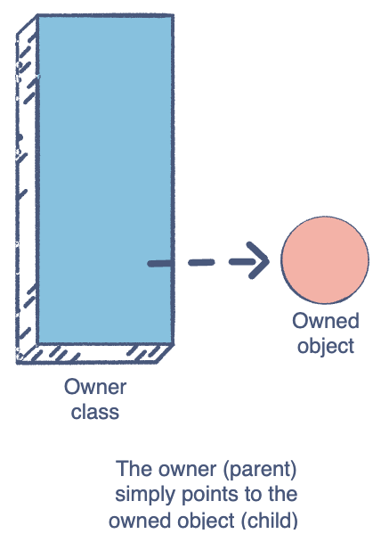

# web dev notes

Java

### Basics

#### foreach-loops


```java
class ForEachExample {
  public static void main(String[] args) {
    int[] primes = {2, 3, 5, 7, 11, 13};
    for(int p: primes) {
      System.out.println(p);
    }
  }
}
```

output:

```java
2
3
5
7
11
13
```


#### protected

1. 同一个包中：
    
    - protected成员（字段、方法等）可以被同一包内的所有类访问。
    
2. 不同包中：
    
    - protected成员可以被子类访问，即使这个子类在不同的包中。
    - 但是，子类只能通过继承的方式访问父类的protected成员，不能直接访问其他类的实例的protected成员。

#### field

类的成员变量被称作字段（fields）

static field

1. 静态字段（Static fields）：
    
    - 所有实例共享同一个字段。
    - 当一个实例修改静态字段时，这个修改会影响到所有其他实例。
    - 静态字段属于类本身，而不是单个实例。
    
2. 非静态字段（Non-static fields）：
    
    - 每个实例都有自己的字段副本。
    - 当一个实例修改其非静态字段时，只会影响该实例自己的字段值。
    - 其他实例的相同字段不会受到影响。

final field

一旦被赋值，final字段的值就不能再被改变。


```java
class Car {
  // Final variable capacity
  final int capacity = 4;
}

class Demo {
   public static void main(String args[]) {
      Car car = new Car();
      car.capacity = 5; // Trying to change the capacity value
   }
}
```

output: 
```java
main.java:9: error: cannot assign a value to final variable capacity car.capacity = 5; // Trying to change the capacity value ^ 1 error
```

#### func overloading

overloading：同名不同参。

多态（Polymorphism）是面向对象编程中一个非常重要的概念，而方法重载（overloading）在实现多态中扮演着至关重要的角色。

构造器就是典型例子。

构造器分类：Default constructor, parameterized constructor

> 如果你没有定义任何构造函数，Java编译器会为你插入一个默认构造函数。因此，一旦类被编译，它至少会有一个无参数的构造函数。

#### this

在Java中，有几种情况下必须使用`this`关键字。

1. 区分局部变量和实例变量

当方法或构造函数的参数名与实例变量名相同时，必须使用`this`来明确指向实例变量。

```java
public class Person {
    private String name;

    public Person(String name) {
        this.name = name; // 必须使用this
    }
}
```

2. 在构造函数中调用另一个构造函数

当一个类有多个构造函数，并且想在一个构造函数中调用另一个构造函数时，必须使用`this()`。

```java
public class Rectangle {
    private int width, height;

    public Rectangle() {
        this(1, 1); // 调用另一个构造函数
    }

    public Rectangle(int width, int height) {
        this.width = width;
        this.height = height;
    }
}
```

3. 将当前对象作为参数传递

当需要将当前对象作为参数传递给另一个方法时，必须使用`this`。

```java
public class Node {
    private Node next;

    public void setNext(Node node) {
        node.next = this; // 将当前对象作为参数传递
    }
}
```

4. 返回当前对象以实现方法链

当想要实现方法链（method chaining）时，必须返回`this`。

```java
public class StringBuilder {
    private String str = "";

    public StringBuilder append(String s) {
        str += s;
        return this; // 返回当前对象以支持方法链
    }
}

// 使用: new StringBuilder().append("Hello").append(" ").append("World");
```

#### `super` in inheritance

超类(SuperClass)（父类(Parent Class)或基类(Base Class)）：这个类允许在另一个类中重用其非私有成员。  
子类(SubClass)（派生类(Child Class or Derived Class)）：这个类是从超类继承而来的。

子类的对象可以使用：
子类中定义的所有非私有成员，父类中定义的所有非私有成员。

> 有些类是不能继承的，比如final定义的类和内置的Integer类；
> 一个类一次只能继承自一个其他类，并且一个类不能继承自己。

1. 访问父类的字段

当子类和父类有同名字段时，使用super访问父类字段。
```java
class Parent {
    int x = 10;
}
class Child extends Parent {
    int x = 20;
    void printX() {
        System.out.println("子类的x: " + x);
        System.out.println("父类的x: " + super.x);
    }
}
```

2. 调用父类的方法

当子类重写了父类的方法，但仍需调用父类的该方法时。
```java
class Animal {
    void makeSound() {
        System.out.println("动物发出声音");
    }
}
class Dog extends Animal {
    void makeSound() {
        super.makeSound();  // 调用父类的方法
        System.out.println("狗吠叫");
    }
}
```

3. 调用父类的构造函数

在子类构造函数中调用父类的构造函数。
```java
class Vehicle {
    Vehicle(String type) {
        System.out.println("创建了一个" + type);
    }
}
class Car extends Vehicle {
    Car() {
        super("汽车");  // 调用父类的构造函数
    }
}
```

#### Inheritance type

##### Single Inheritance


```java
class Vehicle {          //Base Vehicle class  

  private int topSpeed;
  public void setTopSpeed(int speed) {
    this.topSpeed=speed;
    System.out.println("The top speed is set to: "+ topSpeed);
  }

} 

class Car extends Vehicle { // sub class Car extending from Vehicle

  public void openTrunk() {  
    System.out.println("The Car trunk is Open Now"); 
  } 
  
} 

class Main {

  public static void main(String[] args) {  
    Car corolla = new Car(); 
    corolla.setTopSpeed(220);
    corolla.openTrunk();
  } 
```

output:

```java
The top speed is set to: 220 
The Car trunk is Open Now
```

##### Multi-level Inheritance


```java
class Vehicle {          //Base Vehicle class  

  private int topSpeed;

  public void setTopSpeed(int speed) {
    this.topSpeed=speed;
    System.out.println("The top speed is set to: "+ topSpeed);
  }
  
}

class Car extends Vehicle { // Derived from Vehicle Base for Prius

  public void openTrunk() {
    System.out.println("The Car trunk is Open Now!"); 
  } 

} 

class Prius extends Car {// Derived from Prius & can be base to any further class

  public void turnOnHybrid() {
    System.out.println("The Hybrid mode is turned on!"); 
  } 

} 

class Main {

  public static void main(String[] args) {
    Prius priusPrime = new Prius(); 
    priusPrime.setTopSpeed(220);
    priusPrime.openTrunk();
    priusPrime.turnOnHybrid();
  }

}
```

output:

```java
The top speed is set to: 220 
The Car trunk is Open Now! 
The Hybrid mode is turned on!
```

##### Hierarchical Inheritance


```java
class Vehicle {          //Base Vehicle class  

  private int topSpeed;

  public void setTopSpeed(int speed) {
    this.topSpeed=speed;
    System.out.println("The top speed of "+getClass().getSimpleName()+" is set to: "+ topSpeed);
  }

} 

class Car extends Vehicle { // Derived from Vehicle Base for Prius

  //implementation of Car class
} 

class Truck extends Vehicle {// Derived from Prius can be base to any further class

  //implementation of Truck class
} 

class Main {

  public static void main(String[] args) {
    Car corolla = new Car(); 
    corolla.setTopSpeed(220);

    Truck volvo = new Truck();
    volvo.setTopSpeed(120);
  } 

}

```

output:
```java
The top speed of Car is set to: 220 
The top speed of Truck is set to: 120
```

##### Multiple Inheritance


> Only applicable using interfaces in java.

eg:
```java
class Car {  // Base class

  private int model;  // Common features of all cars
  private String manufacturer;

  public Car(int model, String manufacturer) {  // Constructor
    this.model = model;
    this.manufacturer = manufacturer;
  }

  public void printDetails() {

    System.out.println("The model of " + getClass().getSimpleName() + " is: " + model);
    System.out.println("The manufacturer of " + getClass().getSimpleName() + " is: " + manufacturer);
  }

}  // End of Car class

interface IsSedan {  // Interface for sedans

  int bootSpace = 420;  // Sedans have boot space

  void bootSpace();    // Every sedan must implement this

}  // End of IsSedan interface

class Elantra extends Car implements IsSedan {  // Elantra is a Car and is a Sedan also

  private String variant;    // Elantra's data member

  public Elantra(int model, String variant) {  // Constructor
    super(model, "Hyundai");  // Calling the parent constructor with alredy known manufacturer
    this.variant = variant;  
  }

  @Override
  public void bootSpace() { // Implementation of the interface method
    System.out.println("The bootspace of Elantra is: " + IsSedan.bootSpace +" litres");
  }

  @Override
  public void printDetails() {  // Overriding the parent class's inherited method
    super.printDetails();    // Calling the method from parent class
    System.out.println("The variant of Elantra is: " + variant); // printing the data member of this class
  }
  
}  // End of Elantra class


class Main {

  public static void main(String[] args) {

    Elantra sport = new Elantra(2019, "Sport");  //creating Sports variant Elantra
    Elantra eco = new Elantra(2018, "Eco");      //creating Eco variant Elantra

    sport.printDetails();    
    sport.bootSpace();       

    System.out.println();

    eco.printDetails();
    eco.bootSpace();
  }
  
}
```

##### Hybrid Inheritance


> Only applicable using interfaces in java.

#### overloading vs overriding

当然，我很乐意用例子来解释方法重载和方法重写的区别。让我们通过一些具体的代码示例来说明。

1. 方法重载（Method Overloading）：

方法重载是在同一个类中定义多个同名但参数不同的方法。

```java
public class Calculator {
    // 两个整数相加
    public int add(int a, int b) {
        return a + b;
    }
    
    // 三个整数相加
    public int add(int a, int b, int c) {
        return a + b + c;
    }
    
    // 两个浮点数相加
    public double add(double a, double b) {
        return a + b;
    }
}
```

在这个例子中，`add` 方法被重载了三次。编译器会根据传入的参数类型和数量来决定调用哪个方法。

使用示例：
```java
Calculator calc = new Calculator();
System.out.println(calc.add(5, 3));        // 调用第一个方法
System.out.println(calc.add(5, 3, 2));     // 调用第二个方法
System.out.println(calc.add(5.5, 3.2));    // 调用第三个方法
```

2. 方法重写（Method Overriding）：

方法重写是在子类中重新定义父类中已有的方法。

```java
public class Animal {
    public void makeSound() {
        System.out.println("动物发出声音");
    }
}

public class Dog extends Animal {
    @Override
    public void makeSound() {
        System.out.println("狗在汪汪叫");
    }
}

public class Cat extends Animal {
    @Override
    public void makeSound() {
        System.out.println("猫在喵喵叫");
    }
}
```

在这个例子中，`Dog` 和 `Cat` 类都重写了 `Animal` 类的 `makeSound` 方法。

使用示例：
```java
Animal animal1 = new Dog();
Animal animal2 = new Cat();

animal1.makeSound();  // 输出：狗在汪汪叫
animal2.makeSound();  // 输出：猫在喵喵叫
```

主要区别：

1. 重载发生在同一个类中，而重写发生在父子类之间。
2. 重载的方法名相同但参数不同，重写的方法名和参数都相同。
3. 重载是编译时多态（静态绑定），重写是运行时多态（动态绑定）。
4. 重载主要用于增加方法的灵活性，而重写用于实现多态性。

#### Polymorphism

静态多态性（Static polymorphism）也被称为编译时多态性。

动态多态性（Dynamic polymorphism）也被称为运行时多态性。

静态多态性：

1. 在编译时解析。
2. 被称为静态多态性。
3. 静态多态性使用方法重载。

动态多态性：

1. 在运行时解析。
2. 被称为动态多态性。
3. 动态多态性使用方法重写。

#### abstract & interface

| **Interfaces**              | **Abstract Classes**                    |
| --------------------------- | --------------------------------------- |
| 支持多重继承                      | 不支持多重继承                                 |
| 所有成员都是 `public`的            | 可以有`private`, `protected` 和 `public`的成员 |
| 所有数据成员都是`static` 和 `final`的 | 不能有非静态和非最终的成员                           |
| 不能有构造器                      | 可以定义构造函数                                |

抽象方法没有方法体或定义，它只能在抽象类或接口中声明。

非抽象类不能包含抽象方法，所以如果一个类的实现中包含任何抽象方法，那么这个类必须被声明为抽象类。

接口中的方法默认是public abstract的。

```java
// 抽象类中的抽象方法
abstract class Animal {
    // 抽象方法声明，注意没有方法体
    public abstract void makeSound();
    
    // 普通方法
    public void sleep() {
        System.out.println("Zzz...");
    }
}

// 接口中的抽象方法
interface Flyable {
    // 接口中的方法默认是public abstract的，可以省略这些修饰符
    void fly();
}

// 具体类实现抽象类和接口
class Bird extends Animal implements Flyable {
    // 实现抽象类中的抽象方法
    @Override  
    public void makeSound() {
        System.out.println("Tweet tweet!");
    }
    
    // 实现接口中的抽象方法
    @Override // 如果你不实现flying()方法，你会得到一个错误！
    public void fly() {
        System.out.println("The bird is flying.");
    }
}

public class AbstractMethodExample {
    public static void main(String[] args) {
        Bird bird = new Bird();
        bird.makeSound();  // 输出：Tweet tweet!
        bird.sleep();      // 输出：Zzz...
        bird.fly();        // 输出：The bird is flying.
    }
}
```

类使用关键字implements来实现接口，而接口使用关键字extends来继承另一个接口

接口中声明或实现的所有方法默认都是`public`的，所有变量默认都是`public static final`的。

和抽象类一样，接口不能被实例化。

借口中不能有构造函数。

一个类不能继承多个class，但能够implements多个接口。


接口不能声明为`public`或者`private`的。

接口中的static方法不能被重写。

##### functional interfaces

只有一个抽象方法的接口称为函数式接口。

使用@FunctionalInterface注解的一定是functional interface，而functional interface不一定使用@FunctionalInterface注解。


```java
// 使用注解，一定是函数式接口  
@FunctionalInterface  
interface Example1 {  
    void singleMethod();  
}  

// 没有注解，但实际上是函数式接口  
interface Example2 {  
    void singleMethod();  
}  

// 没有注解，不是函数式接口  
interface Example3 {  
    void method1();  
    void method2();  
}
```

#### Class relations

好的,我来为您解释这三种关系,并分别举例说明:

1. IS A (是一个)关系:

这是继承关系,表示一个类是另一个类的特殊类型。

例子:狗是动物
- 动物是一个基类
- 狗是动物的一个子类
- 狗继承了动物的所有基本特征,同时可能有自己特有的属性和方法

代码示例:
```python
class 动物:
    def 呼吸(self):
        print("我能呼吸")

class 狗(动物):
    def 吠叫(self):
        print("汪汪!")

小狗 = 狗()
小狗.呼吸()  # 继承自动物类
小狗.吠叫()  # 狗类特有的方法
```

2. PART-OF (部分-整体)关系:

这表示一个类是另一个类的组成部分,且生命周期完全依赖于整体。

例子:引擎是汽车的一部分
- 汽车是整体
- 引擎是汽车的一个组成部分
- 引擎的生命周期与汽车完全绑定,汽车被销毁时,引擎也就不存在了

代码示例:
```python
class 引擎:
    def 启动(self):
        print("引擎启动")

class 汽车:
    def __init__(self):
        self.引擎 = 引擎()
    
    def 行驶(self):
        self.引擎.启动()
        print("汽车开始行驶")

我的车 = 汽车()
我的车.行驶()
```

3. HAS-A (有一个)关系:

这是聚合关系,表示一个类拥有另一个类的对象,但它们的生命周期可以独立。

例子:人有一部手机
- 人是拥有者
- 手机是被拥有的对象
- 即使人不在了,手机还可以继续存在或被其他人使用

代码示例:
```python
class 手机:
    def 打电话(self):
        print("正在通话中")

class 人:
    def __init__(self, 手机=None):
        self.手机 = 手机
    
    def 使用手机(self):
        if self.手机:
            self.手机.打电话()
        else:
            print("没有手机可用")

小米手机 = 手机()
张三 = 人(小米手机)
张三.使用手机()

# 即使张三不在了,手机还可以被李四使用
李四 = 人(小米手机)
李四.使用手机()
```

##### Aggregation

aggregation遵循has-A模型，其中一个类拥有另一个类的对象，二者的生命周期是独立的。




```java
class Country {
  
    private String name;
    private int population;

    public Country(String n, int p) {
      name = n;
      population = p;
    }
    public String getName() {
      return name;
    }
  
}

class Person {
  
    private String name;
    private Country country; // An instance of Country class

    public Person(String n, Country c) {
      name = n;
      country = c;
    }

    public void printDetails() {
      System.out.println("Name: " + name);
      System.out.println("Country: " + country.getName());
    }
  
}

class Main {
  
  public static void main(String args[]) {
    Country country = new Country("Utopia", 1);
    {
      Person user = new Person("Darth Vader", country);
      user.printDetails();
    }
    // The user object's lifetime is over

    System.out.println(country.getName()); // The country object still exists!
  }
  
}
```

##### Composition

composition遵循part-of模型，其中一个类是另一个类的一部分，被拥有对象的生命周期依赖于拥有者的生命周期。

```java
class Engine {
  
  private int capacity;
  
  public Engine(){
    capacity = 0;
  }
  
  public Engine(int cap) {
    capacity = cap;
  }
  
  public void engineDetails() {
    System.out.println("Engine details: " + capacity);
  }
  
}

class Tires {
  
  private int noOfTires;
  
  public Tires() {
    noOfTires = 0;
  }
  
  public Tires(int nt) {
    noOfTires = nt;
  }
  
  public void tireDetails() {
    System.out.println("Number of tyres: " +  noOfTires);
  }
  
}

class Doors {
  
  private int noOfDoors;
  
  public Doors() {
    noOfDoors = 0;
  }
  
  public Doors(int nod) {
    noOfDoors = nod;
  }
  
  public void doorDetails() {
    System.out.println("Number of Doors: " + noOfDoors);
  }
  
}

class Car {
  
  private Engine eObj;
  private Tires tObj;
  private Doors dObj;
  private String color;
  
  public Car(String col, int cap, int nt, int nod) {
    this.eObj = new Engine(cap);;
    this.tObj = new Tires(nt);;
    this.dObj = new Doors(nod);
    
    color = col;    
  }
  
  public void carDetail() {
    eObj.engineDetails();
    tObj.tireDetails();
    dObj.doorDetails();
    System.out.println("Car color: " + color);
  }
  
}
  
class Main {
  
  public static void main(String[] args) {
    Car cObj = new Car("Black", 1600, 4, 4);
    cObj.carDetail();
  }
}
```

### Recursion


